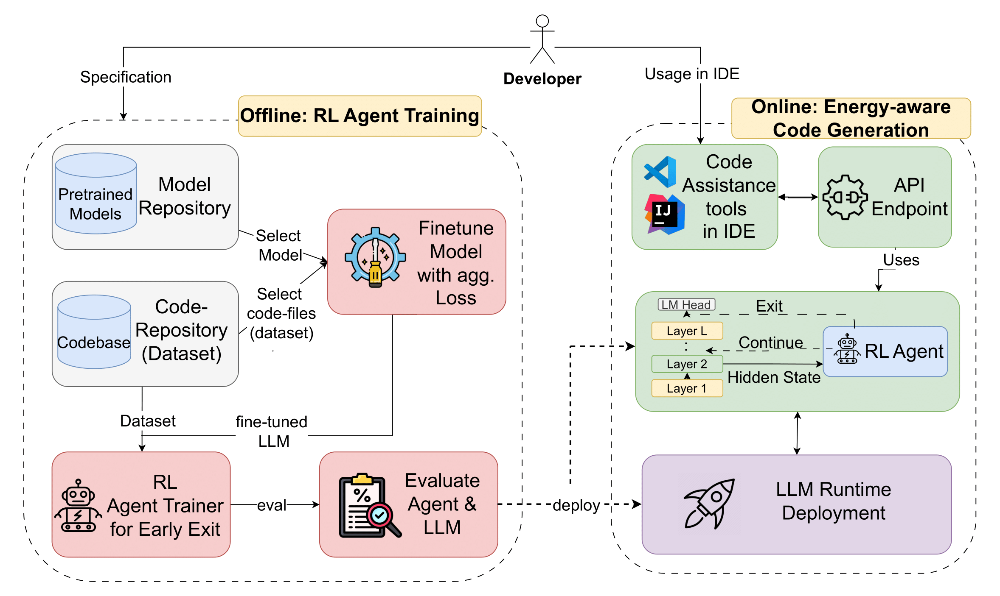

# GREEN-CODE Paper

The high-level view of the GREEN-CODE framework is illustrated in our system model as depicted in the following:


It primarily consists of two parts. (1) offline RL agent training, and (2) online energy-aware code generation.

The offline phase of the GREEN-CODE framework involves several steps. *First*, we begin by selecting appropriate
pre-trained models and standard input datasets that align with the problem requirements, focusing on real-world code
completion tasks. The selected datasets undergo preprocessing to ensure compatibility with the LLM's input format. This
involves tokenization, normalization, and splitting into training, validation, and testing sets, among other processes.
*Second*, we apply a specialized fine-tuning process to make LLMs suitable for early exiting. This involves introducing
an aggregated, weight-based loss function, enabling the model to decode from hidden states of an intermediate layer.
*Third*, we formulate the exit method as a Reinforcement Learning (RL) problem. In this setup, the RL agent is trained
to learn and balance the trade-off between computational resources used, energy consumption, and output quality (
accuracy) by dynamically predicting exit points.  *Finally*, we evaluate RL agent's performance capturing both
model-related performance metrics and resource efficiency metrics, like energy consumption.

Once the RL agent's training converges, during the online phase, the RL agent and the fine-tuned LLMs are deployed on a
service end point for runtime usage.

# Abstract

Large Language Models (LLMs) are becoming integral to daily life, showcasing their vast potential across various Natural
Language Processing (NLP) tasks. Beyond NLP, LLMs are increasingly used in software development tasks, such as code
completion, modification, bug fixing, and code translation. Software engineers widely use tools like GitHub Copilot and
Amazon Q, streamlining workflows and automating tasks with high accuracy. While the resource and energy intensity of LLM
training is often highlighted, inference can be even more resource-intensive over time, as it's a continuous process
with a high number of invocations. Therefore, developing resource-efficient alternatives for LLM inference is crucial
for sustainability. This work proposes GREEN-CODE, a framework for energy-aware code generation in LLMs. GREEN-CODE
performs dynamic early exit during LLM inference. We train a Reinforcement Learning (RL) agent that learns to balance
the trade-offs between accuracy, latency, and energy consumption. Our approach is evaluated on two open-source LLMs,
Llama 3.2 3B and OPT 2.7B, using the JavaCorpus and PY150 datasets. Results show that our method reduces the energy
consumption between 23--50\% on average for code generation tasks without significantly affecting accuracy.

The pretrained models are available at anonymized
zenodo [Link](https://zenodo.org/records/14543583)

# Dependencies

| Name                 | Version  | Purpose                                         |
|----------------------|----------|-------------------------------------------------|
| `accelerate`         | 1.0.0    | Utility for accelerating PyTorch models.        |
| `codebleu`           | 0.7.1    | Metric for evaluating code generation.          |
| `contourpy`          | 1.3.0    | Library for contour plotting.                   |
| `datasets`           | 2.20.0   | Dataset library for NLP tasks.                  |
| `evaluate`           | 0.4.3    | Tool for evaluating NLP model performance.      |
| `gymnasium`          | 0.29.1   | Reinforcement learning environment suite.       |
| `huggingface-hub`    | 0.23.4   | Client library for Hugging Face Hub.            |
| `joblib`             | 1.4.2    | Library for lightweight pipelining in Python.   |
| `Levenshtein`        | 0.26.1   | Library for Levenshtein distance calculations.  |
| `matplotlib`         | 3.9.0    | 2D plotting library for Python.                 |
| `multiprocess`       | 0.70.16  | Multiprocessing for Python.                     |
| `nltk`               | 3.9.1    | Natural Language Toolkit for Python.            |
| `numpy`              | 1.26.4   | Fundamental package for numerical computations. |
| `nvidia-cuda-*-cu12` | 12.1.105 | CUDA Tools.                                     |
| `pandas`             | 2.2.2    | Data analysis and manipulation library.         |
| `rouge_score`        | 0.1.2    | ROUGE score calculations.                       |
| `sacrebleu`          | 2.4.3    | BLEU score calculations.                        |
| `safetensors`        | 0.4.5    | Safe and fast tensor format.                    |
| `scikit-learn`       | 1.5.2    | Machine learning library for Python.            |
| `scipy`              | 1.14.1   | Scientific and technical computing library.     |
| `stable_baselines3`  | 2.3.2    | Reinforcement learning algorithms suite.        |
| `tensorboard`        | 2.18.0   | TensorFlow's visualization toolkit.             |
| `tokenizers`         | 0.20.1   | Fast implementation of tokenizers.              |
| `torch`              | 2.4.1    | PyTorch machine/deep learning library.          |
| `transformers`       | 4.45.2   | Library for NLP with Hugging Face.              |
| `tree-sitter`        | 0.23.1   | Incremental parsing system.                     |
| `zeus-ml`            | 0.10.1   | Energy & Time measurement with GPU support.     |

# Repository Structure

This repository contains all the necessary files and resources related to the GREEN-CODE project. Below is a structured
overview of the key directories and their contents:

## `figures/`

This directory contains all the visualizations and plots used in the paper.

## `results/`

This directory stores all the numerical and analytical results obtained during the experiments. Most of the data is
stored in JSON format. The results include:

- Performance metrics such as BLEU, ROUGE, CHRF, and CodeBLEU scores.
- Execution efficiency data, including time and energy consumption.

## `src/`

This directory contains the complete source code for GREEN-CODE, including implementations for model execution, dataset
handling, evaluation, and training. The subdirectories are structured as follows:

### `src/endpoint/`

Contains the setup and necessary code to run the model as an endpoint, which can be useful for real-time inference in
environments such as VSCode. This implementation is based on
an [endpoint server](https://github.com/LucienShui/huggingface-vscode-endpoint-server) designed for use
with [Huggingface VSCode extensions](https://github.com/huggingface/llm-vscode). The endpoint allows for:

- Running the trained models interactively.
- Making real-time predictions and adapting RL Agent thresholds.

### `src/dataset/`

Provides basic functionality to visualize and analyze the two datasets used in this project.

### `src/eval/`

Includes classes and utility scripts to evaluate the trained models on various benchmarks. The main script is
`evaluator.py`, but additional files provide specialized evaluation methods:

- **BLEU, CodeBLEU, ROUGE, and CHRF evaluation** for measuring code generation quality.
- **Early exit efficiency analysis**,
- **Fine-grained performance tracking**, including per-token accuracy and model confidence scores.

### `src/models/`

Contains code related to the model architectures and reinforcement learning environments:

- Adapted **LLM architectures** to support early exiting.
- **Reinforcement learning (RL) environments** that allow training agents to predict exit layers.

### `src/plotter/`

Includes utilities for plotting results:

- Model performance in efficiency and accuracy
- Energy consumption comparisons.
- Reward distributions across training iterations.
- Exit layer distributions across different inputs and datasets.

### `src/train/`

Contains scripts and configurations for training models, including fine tuning scripts.

## How to

### Load Datasets

Easiest way to use the datasets, is using huggingface versions, for example:

```
 datasets.load_dataset("google/code_x_glue_cc_code_completion_token", name="java")
```

### Endpoint

Run `endpoint\main.py` set argument `pretrained` to a hugginface model ID.

To use in HuggingFace VSCode extension, change `config.json` for example like:

```
...
    
    "llm.attributionEndpoint": "http://localhost:8000/api/generate/",
    "llm.configTemplate": "Custom",
    "llm.modelId": "",
    "llm.requestBody": {


        "options": {
            "num_predict": 10,
            "temperature": 0.2,
            "top_p": 0.95,
            "RL_agent_thresh": 0.9
        }
    },
    "llm.tokenizer": {
        "repository": "Enter model ID"
    },
    "llm.url": "http://localhost:8000/api/generate",
    "llm.contextWindow": 1024

   ...
```

### Evaluation

The main class for evaulation is `Evaluator` in `eval\evaluator.py`, create an instance for example as:

```
model = OPTFixedEESingleHead.from_pretrained(model_id, mode="infer_ee", device_map="cuda", exit_index=i)
tks = AutoTokenizer.from_pretrained(model_id)
dataset =  datasets.load_dataset("google/code_x_glue_cc_code_completion_token", name="python")['test']
eve = Evaluator(, tokenizer, dataset, 1024, device="cuda")
```

then call `evaluator.eval()`
There are a couple of other files that follow similar conventions.

### Load pretrained model

We provide the model weights in Zenodo link from above. To load a model, you can use the following:

```

model_name = "facebook/OPT-2.7B"

config = AutoConfig.from_pretrained(model_name)

model = OPTEESingleHeadRLHiddenState.from_config(config)

model.load_state_dict(torch.load("pytorch_model.bin", map_location="cpu"))  # Adjust path

import torch
device = torch.device("cuda" if torch.cuda.is_available() else "cpu")
model.to(device)

model.eval() # if evaluation
```

### Train RL

There are many options to train the RL, an example is provided below:

```
    def dataset_array_to_string(example):
        example["code"] = ' '.join(example["code"][1:-1])
        return example

    dataset = dataset.map(dataset_array_to_string)
    env = EnvHiddenState(model_id=model_id, num_layers=32, device=device, dataset=dataset, debug=False, allowed_exits=[3,5,7,9,11,13,15,19,23,27], model_max_ctx=1024, start_sample=0, max_samples=None)
    check_env(env)

    model_name= "Test"
    time_curr = int(time.time())
    save_model_callback = SaveModelCallback(save_freq=1000,
                                            save_path=f"./models/{model_id}__hidd_state__{time_curr}__{model_name}")

    new_logger = configure(f'logs/{model_id}__{time_curr}', ["stdout", "csv", "tensorboard"])

    policy_kwargs = dict(
        net_arch=dict(pi=[64,64], vf=[64,64]))

    log_path = ".."

    model = PPO("MlpPolicy", env, verbose=1, learning_rate=linear_schedule(5e-5), tensorboard_log=log_path,
                policy_kwargs=policy_kwargs, seed=420,
                n_steps=4096, batch_size=512, stats_window_size=1, n_epochs=6, device="cuda")
    model.set_logger(new_logger)

    callback = CallbackList([save_model_callback])
    model = model.learn(total_timesteps=500_000, callback=callback, progress_bar=True, )
```
